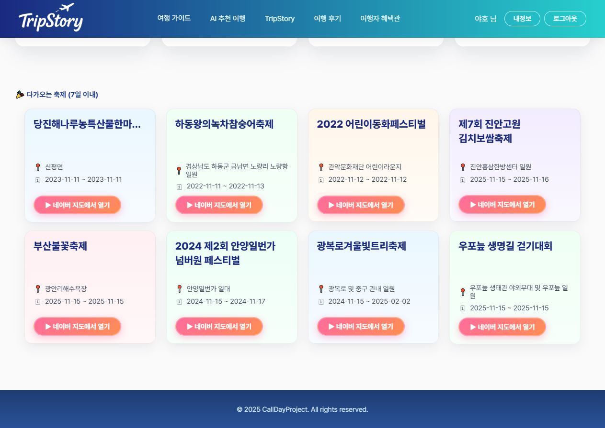
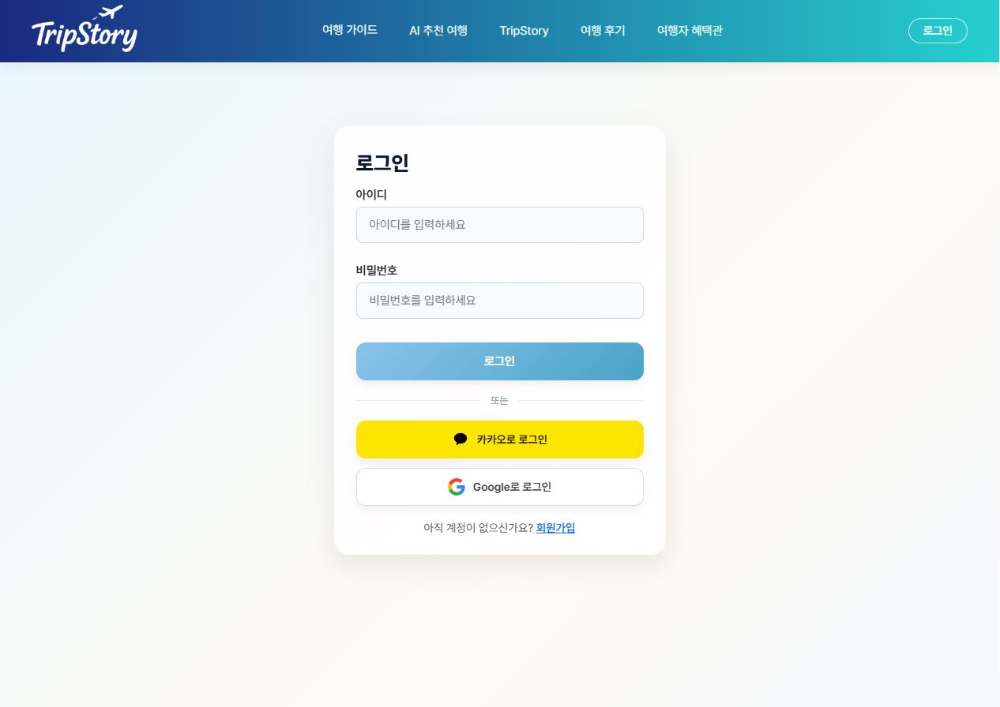

# 🌏 TripStory – AI 기반 여행 기록 & 추천 플랫폼

> **공공데이터 + AI로 여행을 더 스마트하게**  
> “당신의 여행이 이야기가 되는 곳, TripStory”

---

## 📌 프로젝트 개요

| 항목 | 내용 |
|------|------|
| **프로젝트명** | TripStory (트립스토리) |
| **기간** | 2025.10.22 ~ 2025.11.10 (20일) |
| **팀명** | 콜데프 (CallDayProject) |
| **팀장** | 차현탁 |
| **팀원** | 박성훈 · 은지영 · 최민아 |
| **GitHub** | [https://github.com/eternus24/TripStory](https://github.com/eternus24/TripStory) |

---

## 💡 프로젝트 주제

AI를 활용해 사용자의 여행 데이터를 분석하고  
맞춤형 여행 코스 및 스토리를 생성하는 **AI 여행 플랫폼**입니다.

- ✈️ AI 여행 코스 추천 (개인 맞춤형 일정 생성)  
- 🖼️ TripStory AI 웹툰형 여행기록  
- 💬 후기·댓글·좋아요 중심의 커뮤니티  
- 🏆 스탬프 & 등급 시스템  
- 💸 지역 쿠폰 & 로컬마켓 자동 할인  

---

## 🧩 주요 기능 소개

### 🏠 메인 페이지
- 공지사항, 다가오는 축제, 날씨별 추천 코스 카드형 UI  
- 네이버 지도 연동 및 실시간 기온/날씨 반영  

  
  

---

### 🔐 로그인 / 회원가입
- 일반 로그인 및 회원가입 기능 제공  
- 소셜 로그인 (Kakao, Google) 연동  
- 로그인 후 JWT 기반 세션 인증 유지  

---

### 👤 마이페이지
- 여행기록 등록 / 수정 / 승인 상태 표시  
- 누적 여행횟수에 따른 스탬프 자동 지급  
- 지역별 스탬프 지도 및 여행통계 시각화  
- 반려 시 재전송 가능 / 승인 시 자동 반영  
- UI: 등급 표시, 모달창, 통계그래프  

  
  
  
  

---

### 🧑‍💼 관리자 페이지
- 관리자 전용 로그인 (보안 코드 기반 회원가입)  
- 유저 관리 / 권한 부여 / 공지사항 등록 / 통계 확인  
- 방문자 수, 회원 수, 스탬프 등 시각화  

  
  
  
  

---

### 🤖 AI 여행 추천
- 사용자가 출발지, 테마, 기간 입력 시 개인 맞춤형 여행 코스 자동 생성  
- OpenAI API 기반 자연어 분석으로 코스 구성  
- PDF 저장 및 카카오/네이버 지도 경로 보기 가능  

  
  
.jpg)

---

### 🎨 TripStory (AI 웹툰 여행기록)
- 기존 여행기록 기반으로 AI가 웹툰 컷 자동 생성  
- 제목, 설명, 해시태그 입력 및 게시글 등록 가능  

  
  

---

### 💰 로컬마켓 & 쿠폰
- 지역 방문 누적 시 자동 쿠폰 발급  
- 쿠폰 상태(사용가능/만료/완료) 구분 관리  
- 지역별 상품 할인 자동 적용  

.JPG)  
.JPG)  
.JPG)

---

### 💬 후기게시판 / 커뮤니티
- 국내/해외/전체 필터, 좋아요·댓글 실시간 반영  
- 해시태그 검색 및 페이지네이션 지원  

.JPG)  
.JPG)  
.JPG)  
.JPG)

---

## 📸 기능별 스크린샷 모아보기 (자세히 보기 / 간략히 보기)

🏠 메인 / 날씨 / 축제 추천

  
  
.JPG)  
.JPG)  
  
  
.JPG)  
.JPG)

---

🧑‍💼 관리자 페이지

  
  
  
  
  

---

🤖 AI 여행추천

  
  
.jpg)

---

🎨 TripStory (AI 웹툰 생성)

  
  

---

👤 마이페이지 / 스탬프 / 쿠폰

  
  
  
  
  

---

💬 후기게시판 / 커뮤니티

.JPG)  
.JPG)  
.JPG)  
.JPG)

## ⚙️ 기술 스택

| 구분 | 기술 |
|------|------|
| **Front-End** | React, Styled-Components, Axios, React Router, Recharts |
| **Back-End** | Node.js, Express, MongoDB, Mongoose |
| **API 연동** | OpenWeatherMap, KMA, Naver Maps, KTO 축제 API, KakaoMap |
| **AI 연동** | OpenAI API (ChatGPT 기반 코스 생성 & 이미지 변환) |
| **Tools** | GitHub, VSCode, Postman, Figma, Canva, Notion |

---

## 💖 Thanks to

> - CallDayProject 팀, 2025 11 10
