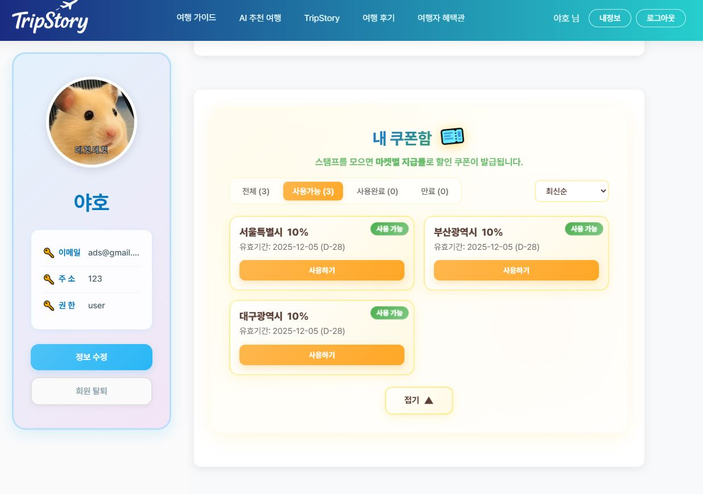
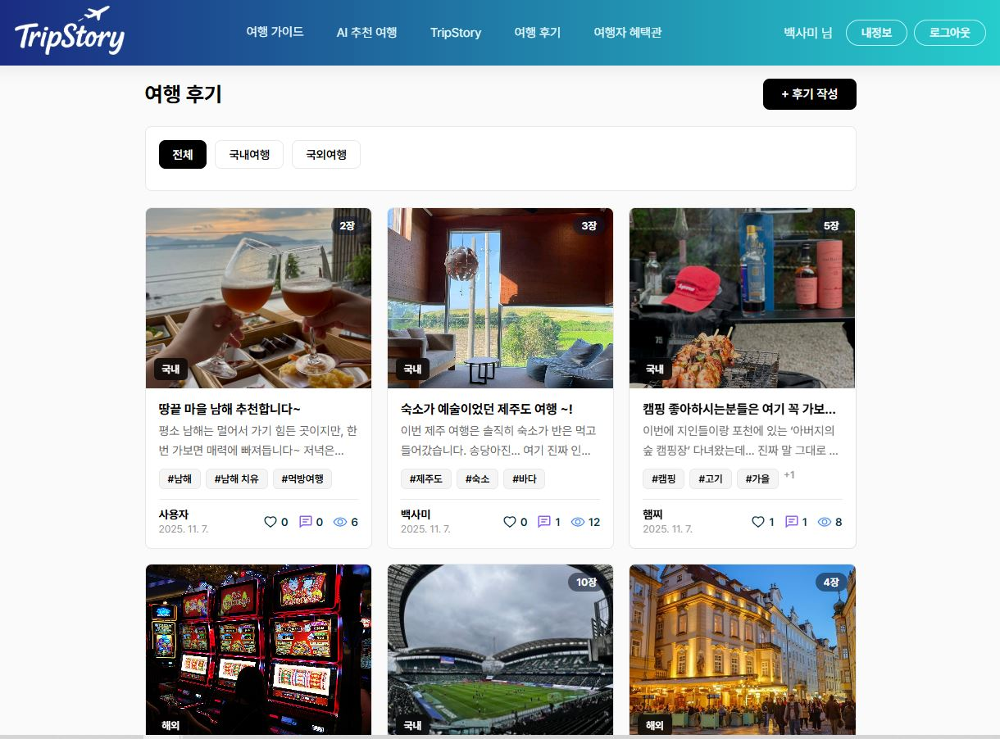
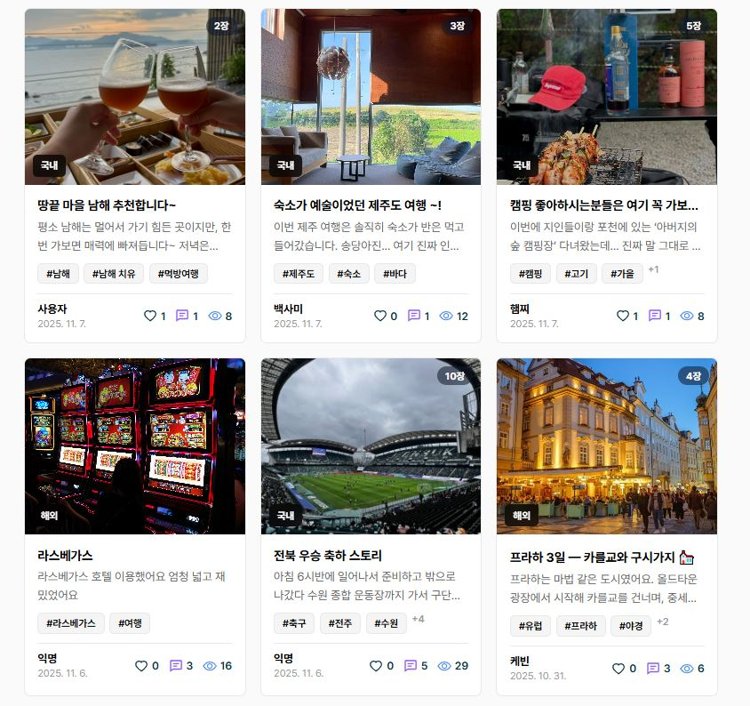
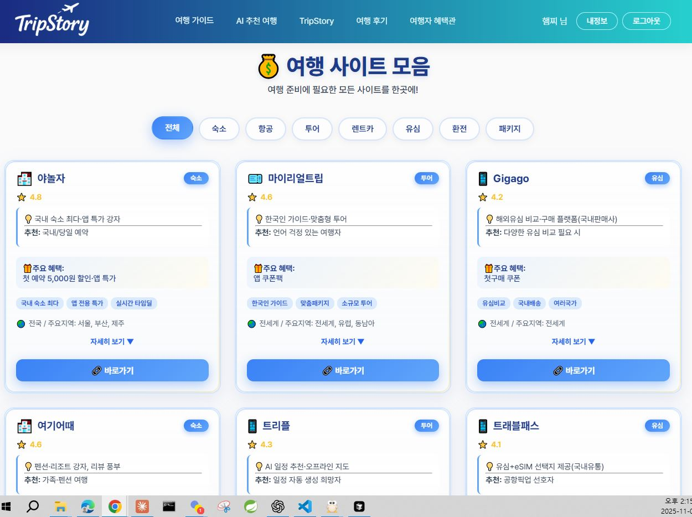
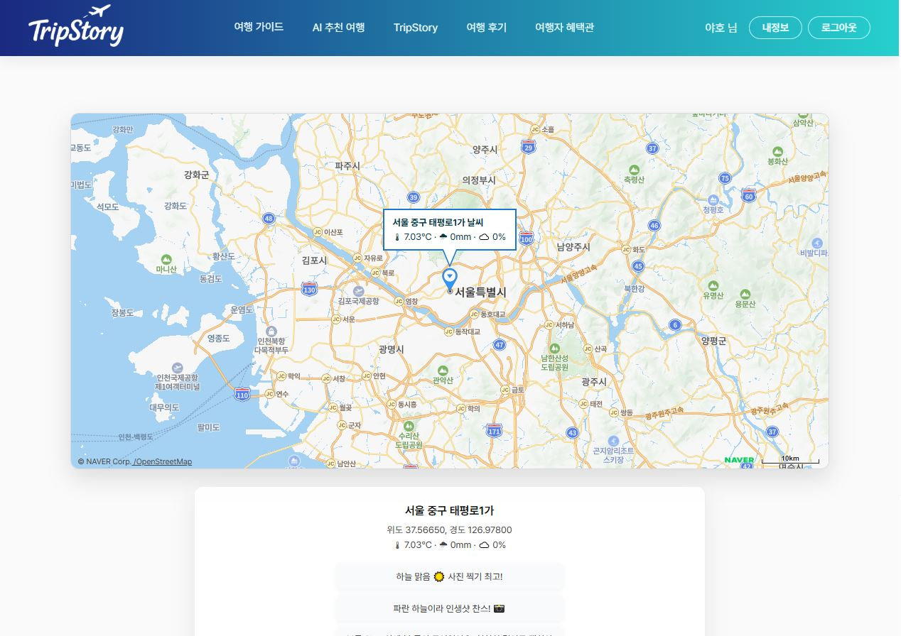
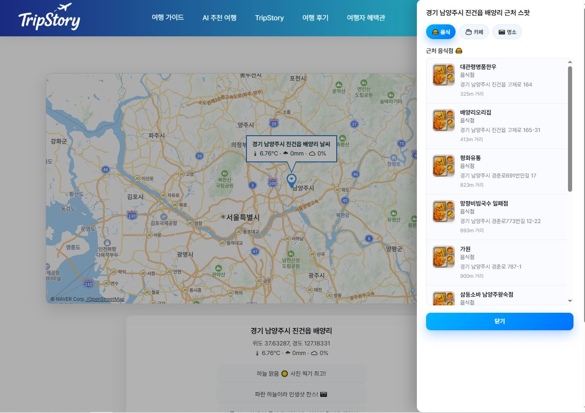
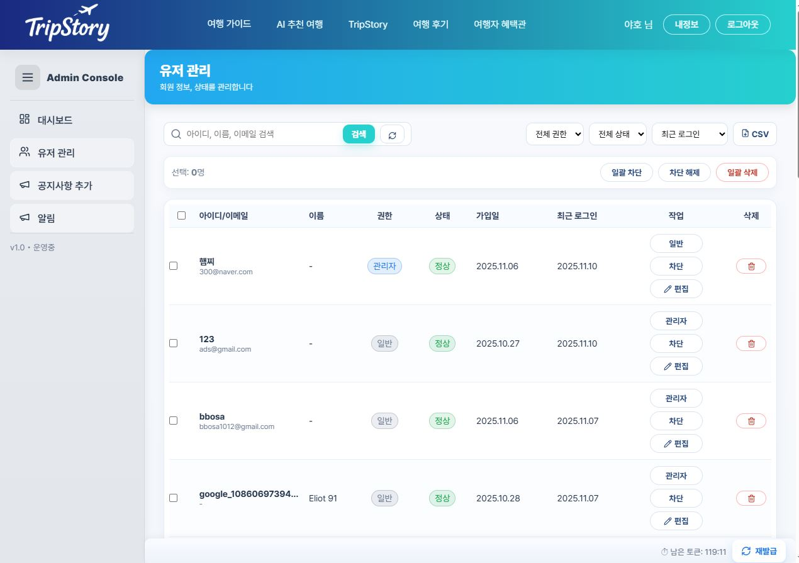

# 🌏 TripStory – AI 기반 여행 기록 & 추천 플랫폼

> **공공데이터 + AI로 여행을 더 스마트하게**  
> “당신의 여행이 이야기가 되는 곳, TripStory”

---

## 💡 프로젝트 주제

AI를 활용해 사용자의 여행 데이터를 분석하고  
맞춤형 여행 코스 및 스토리를 생성하는 **AI 여행 플랫폼**입니다.

- ✈️ AI 여행 코스 추천 (개인 맞춤형 일정 생성)
- 🖼️ TripStory AI 웹툰형 여행기록
- 💬 후기·댓글·좋아요 중심의 커뮤니티
- 🏆 스탬프 & 등급 시스템
- 💸 지역 쿠폰 & 로컬마켓 자동 할인

---

## 🧩 주요 기능 소개

---

### 🏠 메인 페이지

사용자가 처음 진입하는 메인 화면으로,  
날씨 기반 추천 코스 / 축제정보 / 공지사항 / 인기 여행기록 등이 한눈에 보이도록 구성되어 있습니다.  
KMA 날씨 API, KTO 축제 API, 네이버 지도 API를 연동해  
**실시간 지역별 추천 코스와 축제 정보**를 제공합니다.

자세히 보기 / 간략히 보기

  
  

<b>메인 페이지</b> &nbsp;&nbsp;&nbsp; <b>날씨별 추천 코스</b>

  
  

<b>축제정보 메인</b> &nbsp;&nbsp;&nbsp; <b>축제 카드 리스트</b>

---

### 🔐 로그인 / 회원가입

사용자 인증 및 접근제어 기능을 담당하는 페이지입니다.  
일반 로그인, 카카오·구글 소셜로그인 모두 지원하며  
JWT 기반 인증 구조로 토큰 만료 시 자동 재발급이 이루어집니다.  
회원가입 시 유효성 검사를 포함한 클라이언트-서버 연동 구조입니다.

자세히 보기 / 간략히 보기

  
  

<b>로그인</b> &nbsp;&nbsp;&nbsp; <b>등급 안내 모달</b>

---

### 👤 마이페이지

사용자 개인화 페이지로,  
등록한 여행 목록과 승인 상태, 누적 스탬프, 등급 상승 여부, 쿠폰 관리 기능을 제공합니다.  
등급에 따라 색상과 아이콘이 다르게 표시되며,  
관리자 승인 이후 스탬프가 자동으로 추가됩니다.

자세히 보기 / 간략히 보기

  
  

<b>마이페이지</b> &nbsp;&nbsp;&nbsp; <b>여행 목록</b>

  
  

<b>스탬프 지도</b> &nbsp;&nbsp;&nbsp; <b>쿠폰함</b>

---

### 🧑‍💼 관리자 페이지

사이트 전체의 데이터를 관리하는 전용 관리자 화면입니다.  
가입자 수, 방문자 수, 승인 대기 내역 등을 실시간으로 조회할 수 있으며,  
공지사항 등록·수정, 유저 승인·반려 처리 등 기능을 포함합니다.

자세히 보기 / 간략히 보기

  
  

<b>관리자 대시보드</b> &nbsp;&nbsp;&nbsp; <b>통계 그래프</b>

  
  

<b>공지사항 등록</b> &nbsp;&nbsp;&nbsp; <b>승인 관리</b>

---

### 🤖 AI 여행 추천

OpenAI API를 활용한 AI 기반 코스 생성 페이지입니다.  
출발지, 지역, 테마, 여행기간을 입력하면  
AI가 일정·추천코스·여행 키워드를 자동으로 구성해줍니다.  
PDF 다운로드 및 지도 미리보기 기능도 포함되어 있습니다.

자세히 보기 / 간략히 보기

  
  

<b>AI 추천 입력</b> &nbsp;&nbsp;&nbsp; <b>AI 추천 결과</b>

---

### 🎨 TripStory (AI 웹툰 생성)

사용자의 여행 데이터를 기반으로 AI가 웹툰 형식의 여행기록을 생성하는 페이지입니다.  
입력한 여행 제목, 지역, 감정 키워드 등을 토대로  
AI가 장면별 이미지 컷을 만들어내며, 이를 여행 다이어리처럼 저장할 수 있습니다.

자세히 보기 / 간략히 보기

  
  

<b>TripStory 메인</b> &nbsp;&nbsp;&nbsp; <b>이미지 생성 모달</b>

---

### 💬 후기게시판 / 커뮤니티

사용자 간의 여행 경험을 공유하는 커뮤니티 기능입니다.  
좋아요, 댓글, 정렬·검색, 해시태그 필터 등이 포함되어 있으며  
AI 추천으로 생성된 여행도 이곳에 공유할 수 있습니다.

자세히 보기 / 간략히 보기

  
  

<b>후기 목록</b> &nbsp;&nbsp;&nbsp; <b>후기 작성</b>

  
  

<b>후기 카드</b> &nbsp;&nbsp;&nbsp; <b>댓글 보기</b>

---

---

## 📸 기능별 세부 화면 모아보기

🏠 메인 / 축제 / 지도

  
  

  
  

🧑‍💼 관리자 / 유저관리 / 통계

  
  

  
  

🎨 TripStory / AI 생성 / 모달

  
  

  
  

---

## ⚙️ 기술 스택

| 구분 | 기술 |
|------|------|
| **Front-End** | React, Styled-Components, Axios, React Router, Recharts |
| **Back-End** | Node.js, Express, MongoDB, Mongoose |
| **API 연동** | OpenWeatherMap, KMA, Naver Maps, KTO 축제 API, KakaoMap |
| **AI 연동** | OpenAI API (ChatGPT 기반 코스 생성 & 이미지 변환) |
| **Tools** | GitHub, VSCode, Postman, Figma, Canva, Notion |

---

## 💖 Thanks to

> - CallDayProject 팀, 2025 11 10
