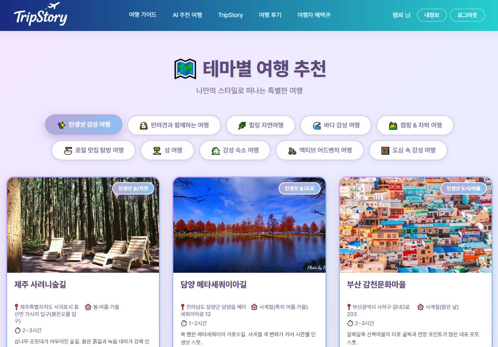
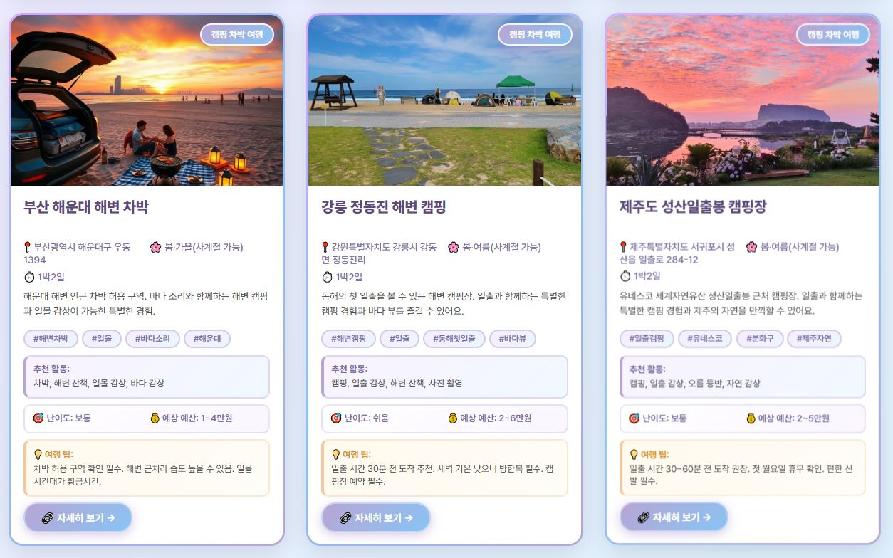
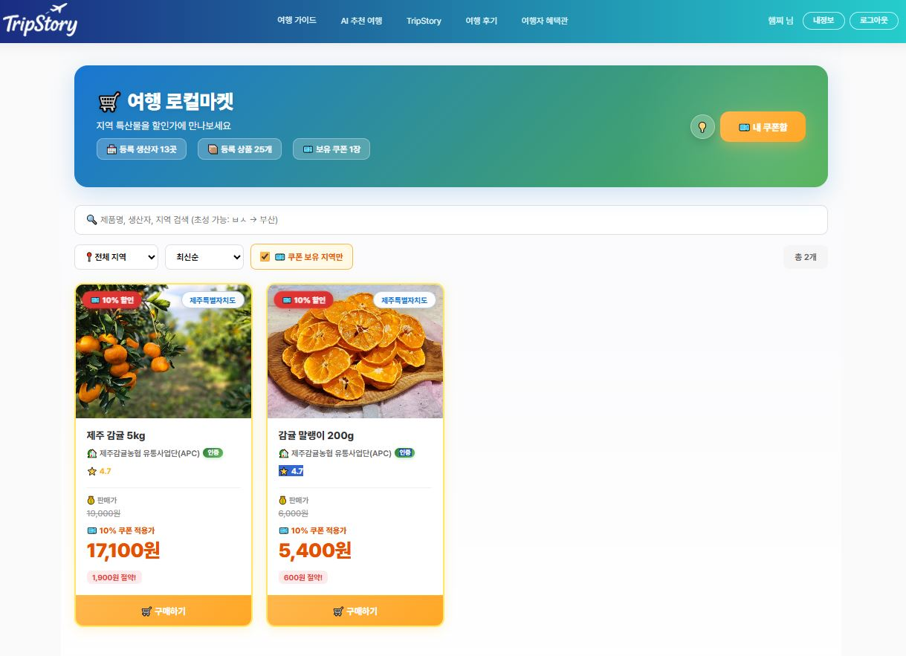
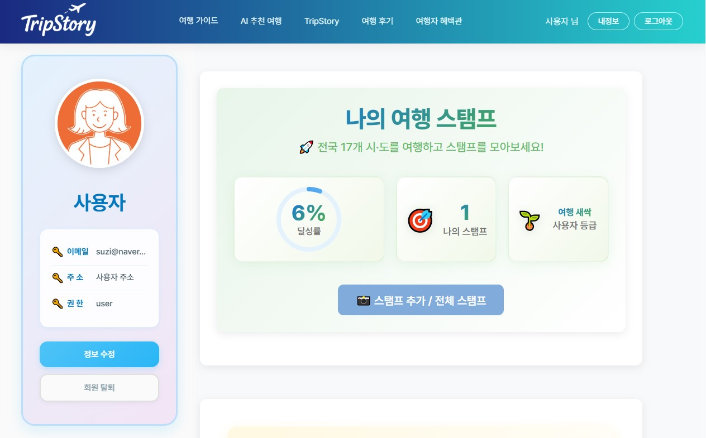
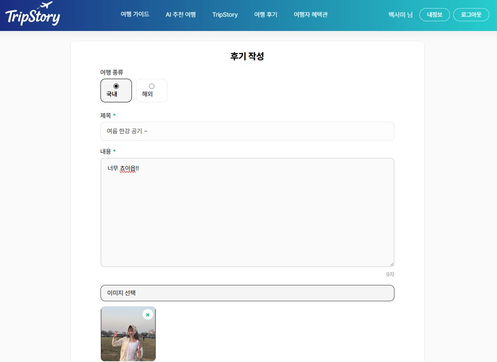

# 🌏 TripStory – AI 기반 여행 기록 & 추천 플랫폼

> **공공데이터 + AI로 여행을 더 스마트하게**  
> “당신의 여행이 이야기가 되는 곳, TripStory”

---

## 📌 프로젝트 개요

| 항목 | 내용 |
|------|------|
| **프로젝트명** | TripStory (트립스토리) |
| **기간** | 2025.10.22 ~ 2025.11.10 (20일) |
| **팀명** | 콜데프 (CallDayProject) |
| **팀장** | 차현탁 |
| **팀원** | 박성훈 · 은지영 · 최민아 |
| **GitHub** | [https://github.com/eternus24/TripStory](https://github.com/eternus24/TripStory) |

---

## 💡 프로젝트 주제

AI를 활용해 사용자의 여행 데이터를 분석하고  
맞춤형 여행 코스 및 스토리를 생성하는 **AI 여행 플랫폼**입니다.

- ✈️ AI 여행 코스 추천 (개인 맞춤형 일정 생성)
- 🖼️ TripStory AI 웹툰형 여행기록
- 💬 후기·댓글·좋아요 중심의 커뮤니티
- 🏆 스탬프 & 등급 시스템
- 💸 지역 쿠폰 & 로컬마켓 자동 할인

---

## 📖 목차

1. [🏠 메인(Main)](#-메인main)
2. [🌤 날씨 & 축제 & 지도](#-날씨--축제--지도weathercourse--festival--map)
3. [🛍 로컬마켓(LocalMarket)](#-로컬마켓localmarket--쿠폰)
4. [🤖 AI 여행 추천(AI Trip)](#-ai-여행-추천ai-trip)
5. [🎨 TripStory (AI 웹툰)](#-tripstory-ai-웹툰)
6. [👤 마이페이지(My Page)](#-마이페이지my-page--스탬프등급)
7. [🧑‍💼 관리자(Admin)](#-관리자admin)
8. [💬 후기게시판(Community)](#-후기게시판community)
9. [🔐 로그인 / 회원가입](#-로그인--회원가입)

---

## 🧩 기능별 화면

---

### 🏠 메인(Main)

사용자가 처음 접하는 요약 허브 화면.  
공지사항·다가오는 축제·날씨별 추천코스·핵심 진입 링크를 한눈에 보여준다.

자세히 보기 / 간략히 보기

  
  

---

### 🌤 날씨 & 축제 & 지도(WeatherCourse / Festival / Map)

KMA 날씨·KTO 축제·네이버 지도 데이터를 결합해  
지역·날씨별 추천코스, 전국 축제 카드, 지도 기반 검색/미리보기 제공.

자세히 보기 / 간략히 보기

  
  

  
  

  
  

  
  

<b>테마별 여행 추천(메인)</b> &nbsp;&nbsp;&nbsp; <b>테마별 여행 추천(카드)</b>

---

### 🛍 로컬마켓(LocalMarket) & 쿠폰

지역 상점/상품을 탐색하고, 여행/스탬프에 연동된 쿠폰을 발급·적용한다.  
모달 상세·쿠폰 전용 뷰 제공.

자세히 보기 / 간략히 보기

  
  

  
  

---

### 🤖 AI 여행 추천(AI Trip)

출발지/지역/테마/기간 입력 → AI가 맞춤 코스·하이라이트·키워드 구성.  
결과 미리보기/확장, 저장/공유 기능 제공.

자세히 보기 / 간략히 보기

  
  

  
  

---

### 🎨 TripStory (AI 웹툰)

여행 기록을 기반으로 AI가 장면별 이미지를 생성해 웹툰처럼 기록.  
입력(제목/지역/감정) → 이미지 생성 모달 → 결과 저장.

자세히 보기 / 간략히 보기

  
  

  
  

---

### 👤 마이페이지(My Page) & 스탬프/등급

내 여행 목록/상태(대기·승인·반려), 스탬프 지도, 등급 안내/상승 알림.  
활동→스탬프→등급→쿠폰까지 연결되는 개인화 핵심 화면.

자세히 보기 / 간략히 보기

  
  

  
  

  
  

---

### 🧑‍💼 관리자(Admin)

공지/승인/유저/통계 등 서비스 운영 전반.  
대시보드로 핵심 KPI를 시각화하고, 승인·반려·일괄승인 모달 제공.

자세히 보기 / 간략히 보기

  
  

  
  

  
  

  

---

### 💬 후기게시판(Community)

후기 목록·작성·카드·댓글 흐름을 제공.  
좋아요/댓글 인터랙션과 필터·정렬을 지원.

자세히 보기 / 간략히 보기

  
  

  
  

  

<b>후기게시물 – 기능 모음</b>

---

### 🔐 로그인 / 회원가입

사용자 인증 및 접근제어 기능을 담당하는 페이지입니다.  
일반 로그인, 카카오·구글 소셜로그인 모두 지원하며  
JWT 기반 인증 구조로 토큰 만료 시 자동 재발급이 이루어집니다.

자세히 보기 / 간략히 보기

  
  

<b>로그인</b> &nbsp;&nbsp;&nbsp; <b>등급 안내 모달</b>

---

## ⚙️ 기술 스택

| 구분 | 기술 |
|------|------|
| **Front-End** | React, Styled-Components, Axios, React Router, Recharts |
| **Back-End** | Node.js, Express, MongoDB, Mongoose |
| **API 연동** | OpenWeatherMap, KMA, Naver Maps, KTO 축제 API, KakaoMap |
| **AI 연동** | OpenAI API (ChatGPT 기반 코스 생성 & 이미지 변환) |
| **Tools** | GitHub, VSCode, Postman, Figma, Canva, Notion |

---

## 💖 Thanks to

> - CallDayProject 팀, 2025 11 10
